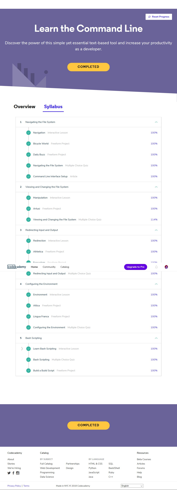
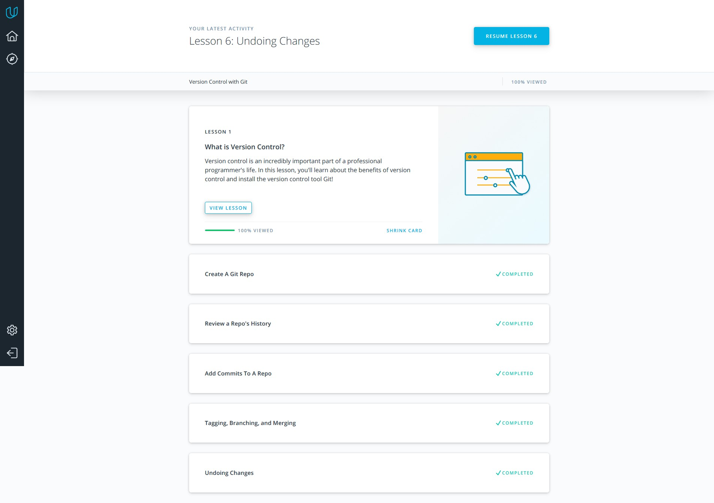
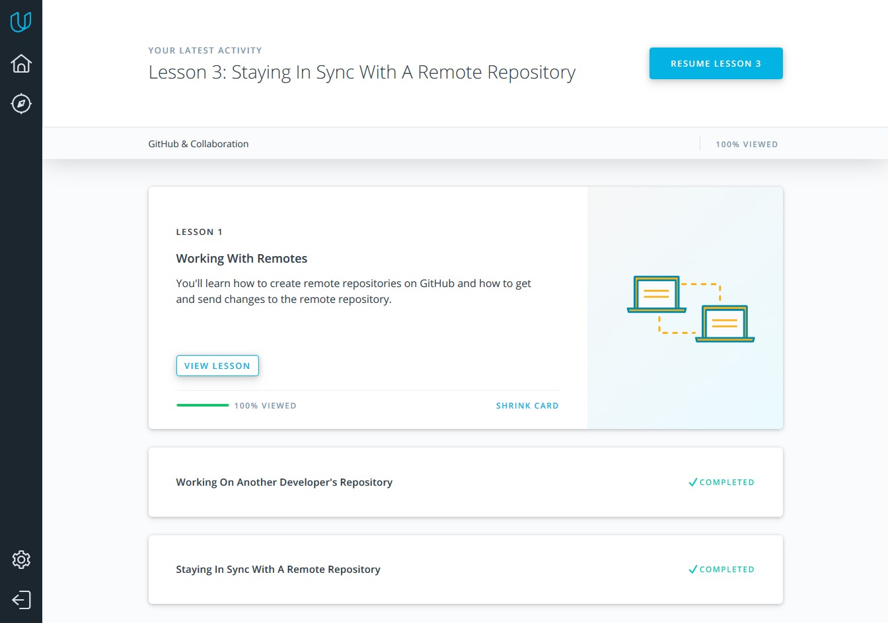

## Linux CLI, and HTTP

**Reflections**
 - **To be honest, new information was in Bash Scripting tutorial.**
 - **A huge amount of information to work was a little surprise for me.**
 - **I'll try to use as much received information as I could in the future.**
 
 ## Git Collaboration
 
 
 

**Reflections**
 - **It's always good to revise your knowledge. Рractice makes perfect. **
 - **No more surprises **
 - **I'll try to use this knowledge in my future projects.**
