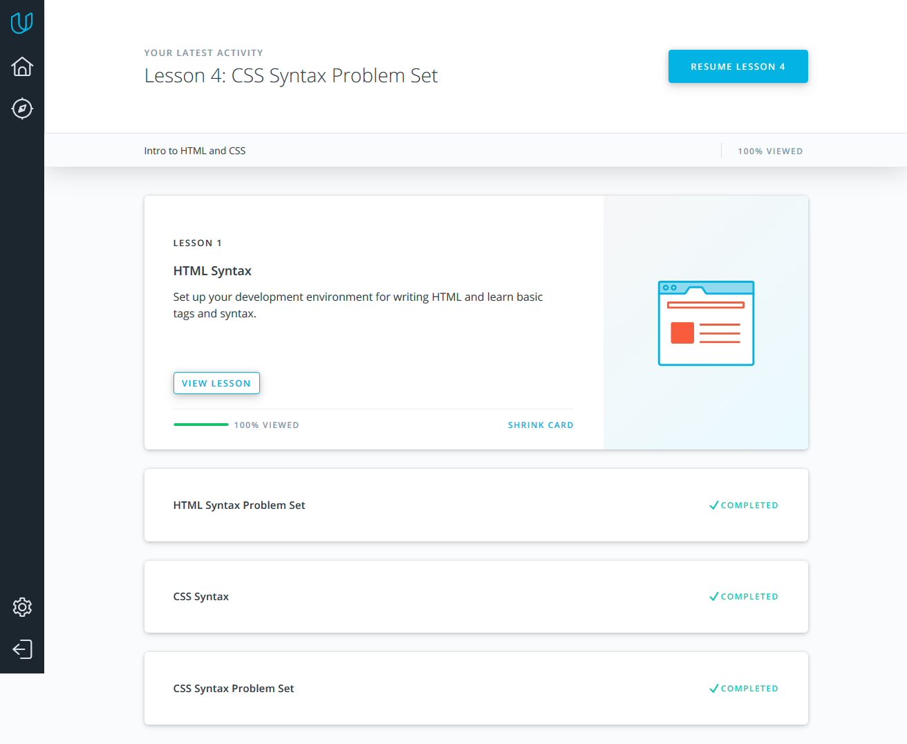
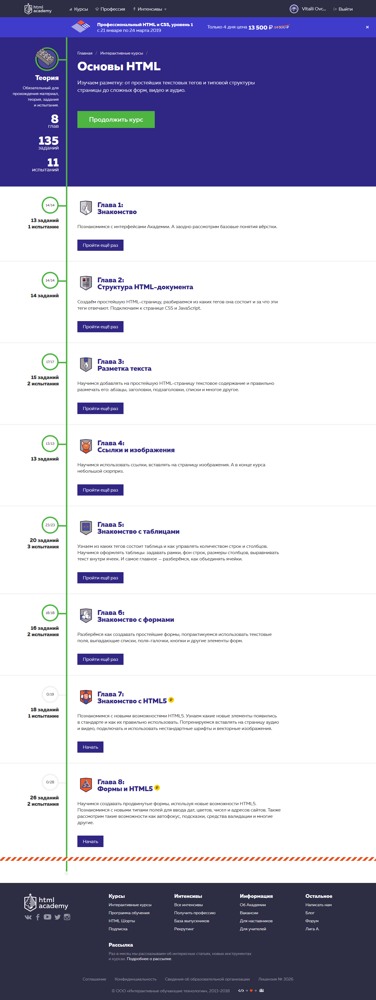
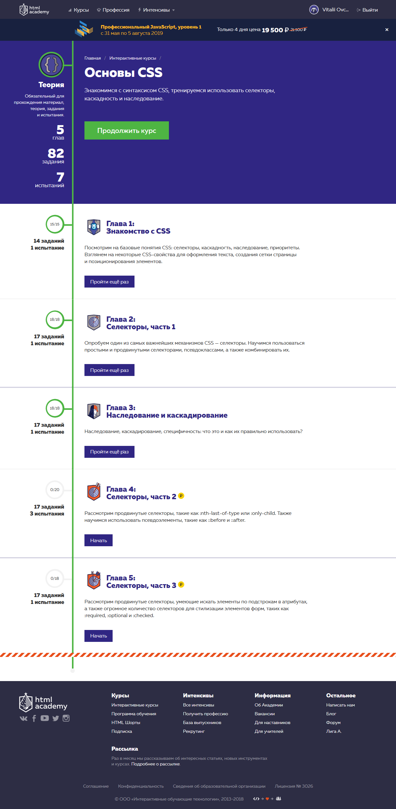
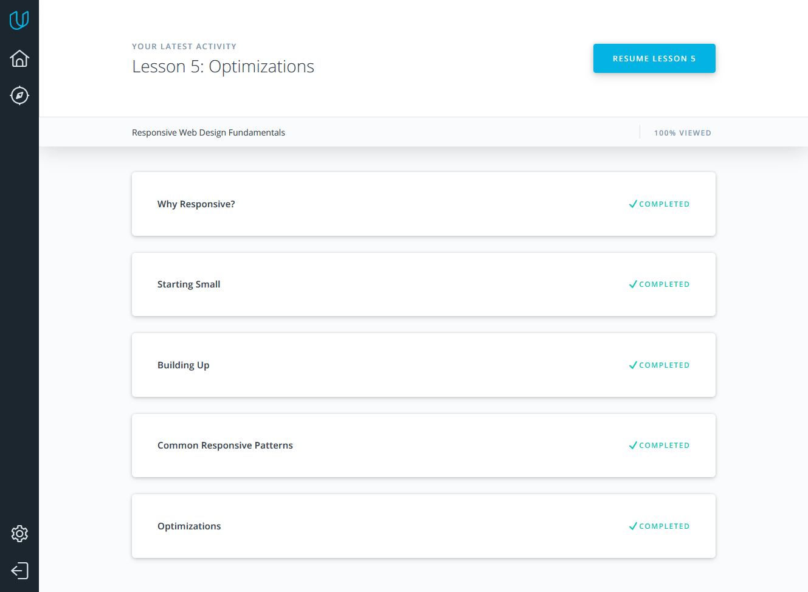
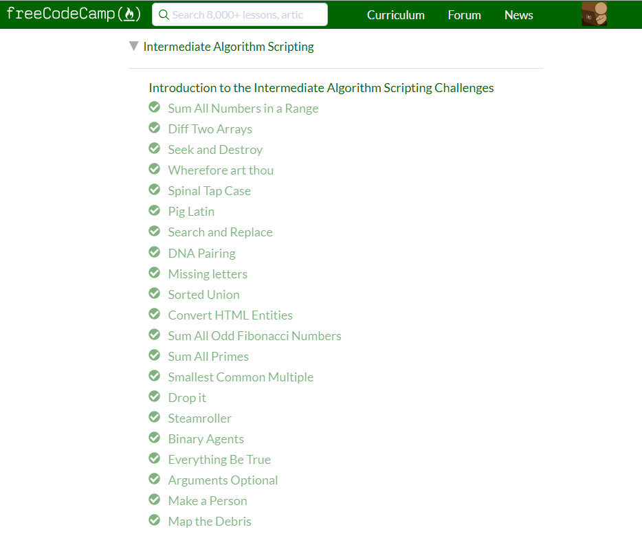
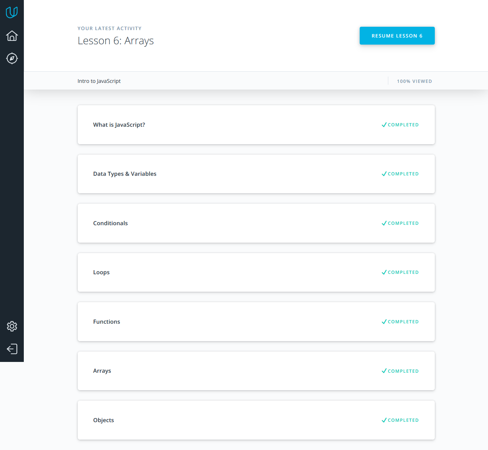
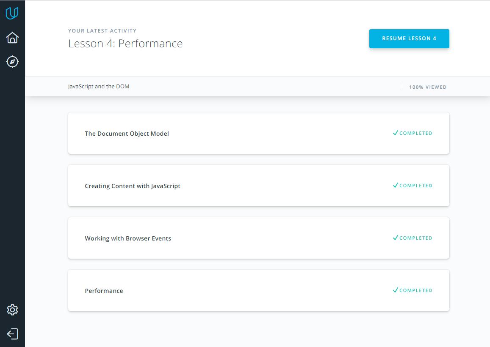

## Linux CLI, and HTTP

[Linux CLI, and HTTP](task_linux_cli/learn-the-command-line.jpg)

**Reflections**
 - **To be honest, new information was in Bash Scripting tutorial.**
 - **A huge amount of information to work was a little surprise for me.**
 - **I'll try to use as much received information as I could in the future.**
 
 ## Git Collaboration
 
 [Version Control](task_git_collaboration/Screenshot_Version-Control-with-Git-Udacity.jpg)
 [GitHub Collaboration](task_git_collaboration/Screenshot_GitHub-Collaboration.jpg)

**Reflections**
 - **It's always good to revise your knowledge. Рractice makes perfect.**
 - **No more surprises.**
 - **I'll try to use this knowledge in my future projects.**
 
 ## Intro to HTML and CSS
 
 
 
 
 
**Reflections**
 - **No new information.**
 - **No surprises.**
 
 ## Responsive Web Design
 
 
 

 
**Reflections**
 - **It was very interesting about responsive tables, should definitely use that information.**
 - **I used to play before in Flexbox Froggy.**
 
  ## JS Basics
 
 
 
 
**Reflections**
 - **I really enjoy tasks about Data Structures and Algorithms in JavaScript.**
 
 ## DOM
  
  
  
 **Reflections**
  - **The cssText property was new for me :)**

